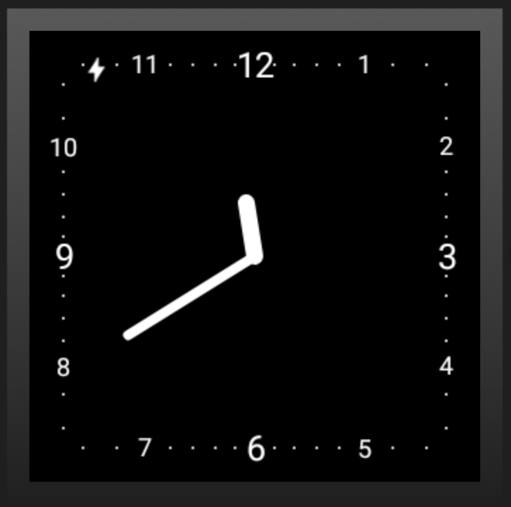
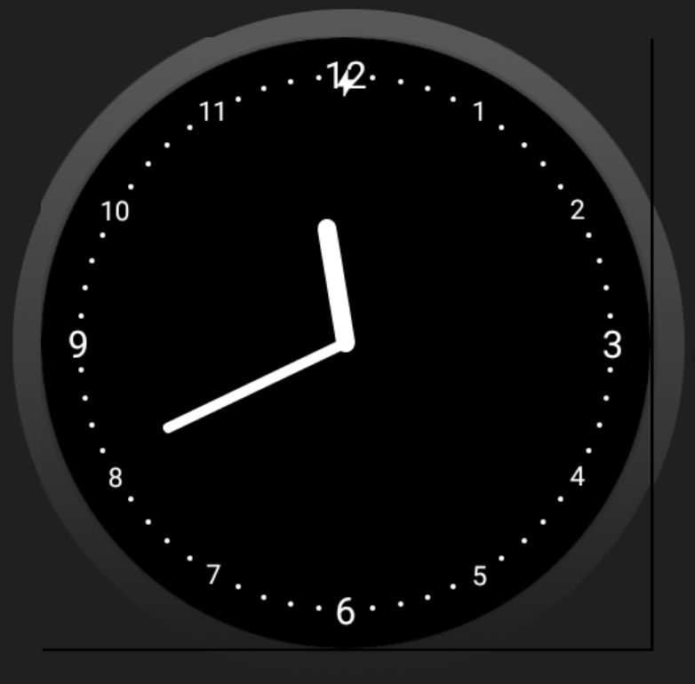
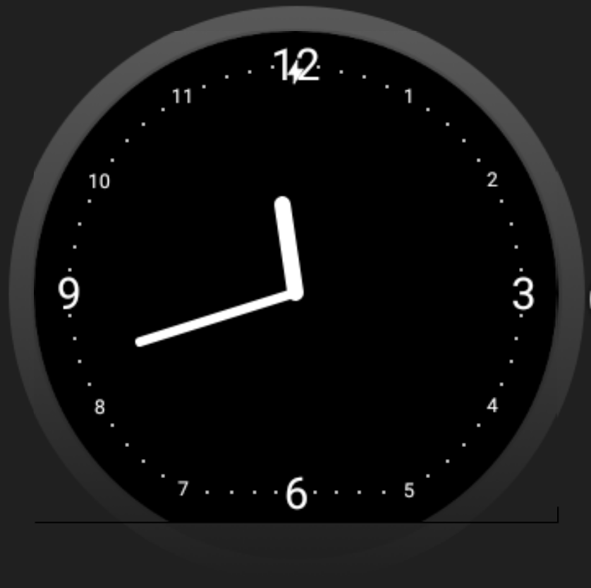

# Wear Face Utils

Helps to calculate a point on a generic Android Wear Watchface by using nothing more than a margin from the outer boundary and an angle. Especially useful for round faces with a chin.

## Usage ##

Inside your [CanvasWatchFaceService.Engine](https://developer.android.com/reference/android/support/wearable/watchface/CanvasWatchFaceService.Engine.html) call:
We'll need this to automatically figure out the watch face format.

```java
@Override
public void onApplyWindowInsets(WindowInsets insets) {
    super.onApplyWindowInsets(insets);
    WearFaceUtils.INSTANCE.init(insets);
}
```

Then use the actual method to calculate your point(s). No need to define your watch face format. One method to rule them all :) 

```java
@Override
public void onDraw(Canvas canvas, Rect bounds) {
    int outerMarginPx = 30; // your margin from the outer boundary of your (generic) watchface.
    double angle = Math.PI / 2; // angle starting at 3 o Clock. 
    
    // main function. Automatically figures out if we're on a circle, circle with chin or square watch face
    Point pointOnFace = WearFaceUtils.INSTANCE.pointOnFace(outerMarginPx, angle, bounds);
    // use your point to draw stuff to the canvas ;)
}
```

Using these points you can then draw elements with a consistent margin from the outer bounds including the form and a chin. Examples results:







You can also force the different formats, regardless of the actual watch you're running on:
```java
    Point pointOnCircleFace = WearFaceUtils.INSTANCE.pointOnCircleFace(outerMarginPx, angle, bounds);
    Point pointOnChinFace = WearFaceUtils.INSTANCE.pointOnChinFace(outerMarginPx, angle, bounds);
    Point pointOnSquareFace = WearFaceUtils.INSTANCE.pointOnRectFace(outerMarginPx, angle, bounds);
```

Download
--------

coming soon...

License
-------

    Copyright 2017 Oliver Metz
        
    Licensed under the Apache License, Version 2.0 (the "License");
    you may not use this file except in compliance with the License.
    You may obtain a copy of the License at
        
       http://www.apache.org/licenses/LICENSE-2.0
              
    Unless required by applicable law or agreed to in writing, software
    distributed under the License is distributed on an "AS IS" BASIS,
    WITHOUT WARRANTIES OR CONDITIONS OF ANY KIND, either express or implied.
    See the License for the specific language governing permissions and
    limitations under the License.


